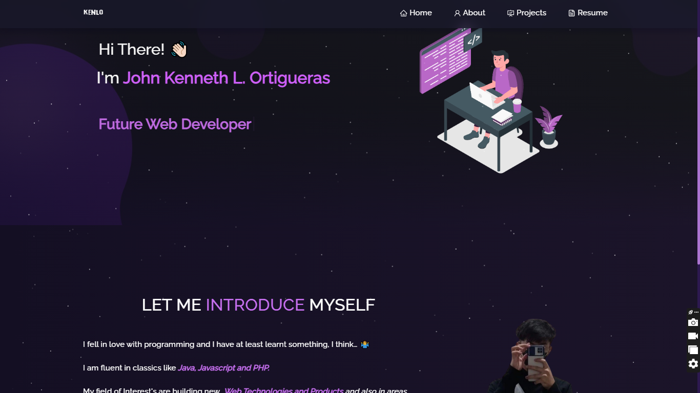
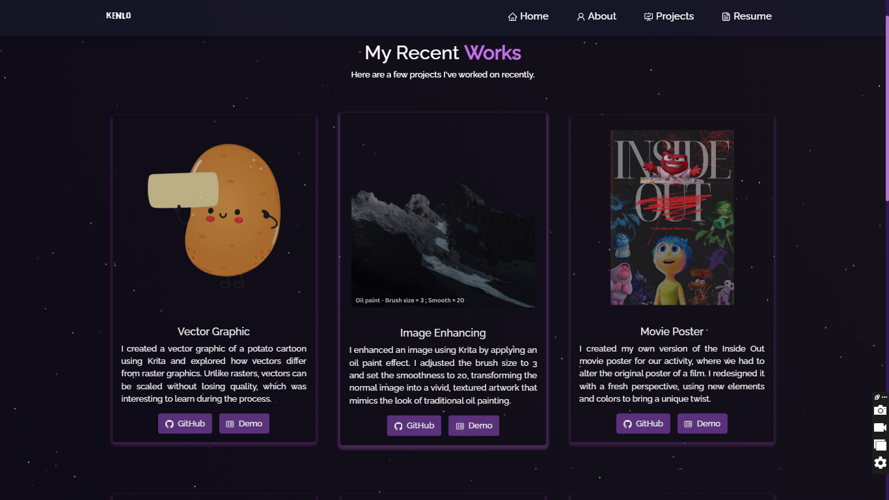

<h2 align="center">
  Portfolio Website - v2.0 
  <a href="https://github.com/kennethadwa/" target="_blank">Kenneth Lorenzo</a>
</h2>

<h4>This portfolio website was created for the completion of the midterm in Multimedia System Subject.</h4>
 

  
   
   

 

This project was built using these technologies.
- React.js
- Node.js
- Express.js
- CSS3
- VsCode
- Vercel
